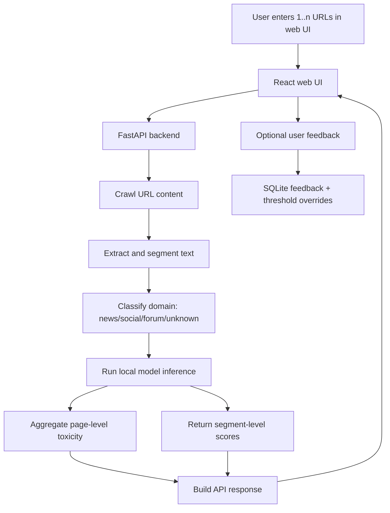

# VietToxic Detector

Research prototype for Vietnamese toxic content detection from URLs.

## Overview

The current system lets a user submit one or more URLs from the web UI. The backend then:

1. Crawls content from each URL
2. Extracts and segments the text
3. Optionally merges page text with available video transcript text
4. Runs a local NLP model for toxicity detection
5. Returns page-level and segment-level results to the UI

This repository now reflects a web app workflow. Older browser-extension and `/predict` flows are deprecated and no longer part of the active system.

## Current Architecture

- Frontend: React + TypeScript + Vite
- Backend: FastAPI
- Models:
  - PhoBERT fine-tuned checkpoints
  - TF-IDF + Logistic Regression baseline
- Crawling and text extraction:
  - `trafilatura`
  - Selenium + `undetected-chromedriver` fallback
  - VnCoreNLP for Vietnamese word segmentation support
- Feedback storage: SQLite

## Main Flow



## Features

- Analyze one or more URLs from the web UI
- Crawl real webpage content before inference
- Return:
  - page-level toxicity score
  - segment-level toxicity scores
  - domain category and threshold used
- Compare multiple local models on the same URLs
- Collect user feedback on page-level and segment-level predictions
- Preview and apply domain threshold updates from stored feedback
- Optional Gemini-based explanation for results when `GEMINI_API_KEY` is configured

## Project Structure

```text
backend/app.py                     FastAPI server and API endpoints
comprehensive_ui/                  React + TypeScript + Vite frontend
infer_crawled_local.py             Local inference pipeline
setup_and_crawl.py                 URL crawling and extraction pipeline
domain_classifier.py               Domain classification + threshold rules
scripts/                           Data prep, EDA, training scripts
models/options/                    Local model checkpoints
data/                              Datasets, crawled content, processed outputs
reports/eda/                       EDA outputs
experiments/                       Experiment and crawling logs
```

## Local Run

### Backend

```bash
python3 -m venv venv
source venv/bin/activate
pip install -r requirements.txt
uvicorn backend.app:app --reload --port 8000
```

### Frontend

```bash
cd comprehensive_ui
npm install
npm run dev
```

Default local URLs:

- Backend: `http://localhost:8000`
- Frontend: `http://localhost:5173`

## API

Current API is defined in `backend/app.py`.

### Core endpoints

- `GET /`
  - basic status message
- `GET /health`
  - health check
- `GET /api/models`
  - list available local models and default model
- `POST /api/analyze`
  - crawl URLs, run inference, return page-level and segment-level results
- `POST /api/analyze_compare`
  - run the same URLs through multiple models and compare outputs

### AI explanation

- `POST /api/ask-ai`
  - available when `GEMINI_API_KEY` is configured
  - generates a short explanation for a result using Gemini

### Feedback and threshold endpoints

- `POST /api/feedback`
  - submit page-level feedback
- `POST /api/feedback/segment`
  - submit segment-level feedback
- `POST /api/thresholds/preview`
  - preview suggested thresholds from stored feedback
- `POST /api/thresholds/apply`
  - apply updated thresholds
- `POST /api/thresholds/current`
  - read current effective thresholds and overrides

## Example Request

```bash
curl -X POST http://localhost:8000/api/analyze \
  -H "Content-Type: application/json" \
  -d '{
    "urls": [
      "https://vnexpress.net/tranh-cai-ve-so-danh-hieu-cua-messi-4991489.html",
      "https://tuoitre.vn/cach-nao-de-cham-dut-viec-chui-boi-xuc-pham-tren-mang-20211027223924572.htm"
    ],
    "options": {
      "model_name": "phobert/v1",
      "batch_size": 8,
      "max_length": 256,
      "page_threshold": 0.25,
      "seg_threshold": 0.4,
      "enable_video": true
    }
  }'
```

## Available Model Types

- `phobert/<name>`
- `tfidf_lr/<name>`

Model artifacts are resolved from `models/options/`.

## Data and Training Pipeline

The repository also includes research scripts for:

- exporting raw ViCTSD data
- preprocessing into `data/processed/victsd_v1`
- exploratory data analysis
- training TF-IDF + Logistic Regression baseline
- fine-tuning PhoBERT

See `scripts/01_export_raw.py` through `scripts/05_train_phobert.py`.

## Current Status

- Web UI is implemented
- URL analysis works end-to-end
- Local model comparison is implemented
- Feedback loop is implemented
- Domain-aware thresholding is implemented
- Local model artifacts are present in `models/options/`

## Known Limitations

- An older README version contained deprecated browser-extension and `/predict` flow descriptions
- This system is a research prototype, not a production deployment
- Crawling reliability depends on target site structure and anti-bot behavior
- Some UI pages still contain demo or static content rather than live experiment data
- Gemini explanation requires external API access and `GEMINI_API_KEY`

## Notes

- CORS is configured for local Vite development and ngrok testing
- Feedback data and threshold overrides are stored in SQLite under `data/processed/feedback/`
- Default model selection depends on locally available artifacts
