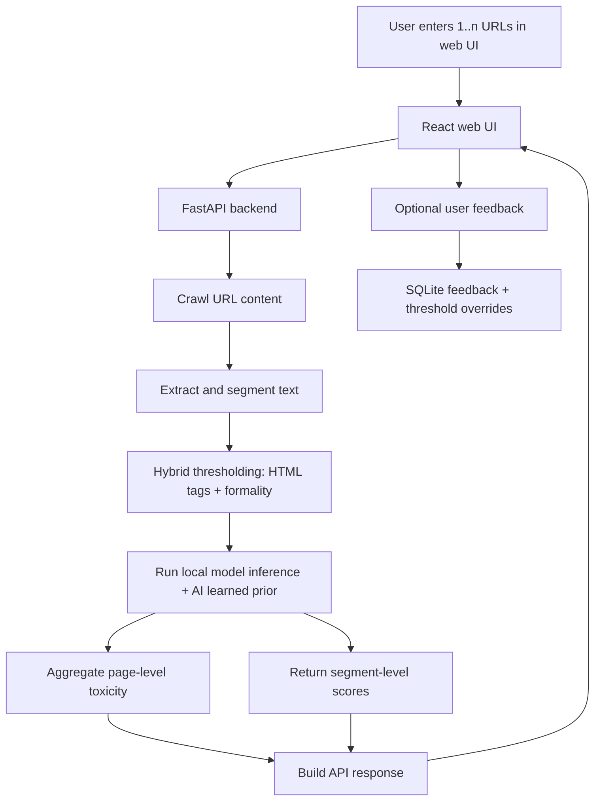

# VietToxic Detector

Research prototype for Vietnamese toxic content detection from URLs.

## Overview

The current system lets a user submit one or more URLs from the web UI. The backend then:

1. Crawls content from each URL
2. Extracts and segments the text
3. Optionally merges page text with available video transcript text
4. Runs a local NLP model for toxicity detection
5. Returns page-level and segment-level results to the UI

This repository now reflects a web app workflow. Older browser-extension and `/predict` flows are deprecated and no longer part of the active system.

## Current Architecture

- Frontend: React + TypeScript + Vite
- Backend: FastAPI
- Models:
  - PhoBERT fine-tuned checkpoints
  - TF-IDF + Logistic Regression baseline
- Crawling and text extraction:
  - `trafilatura`
  - Selenium + `undetected-chromedriver` fallback
  - VnCoreNLP for Vietnamese word segmentation support
- Feedback storage: SQLite

## Main Flow



## Features

- Analyze one or more URLs from the web UI
- Crawl real webpage content before inference
- Interactive Selenium decision flow for hard URLs:
  - backend can pause and ask for per-URL decision (`use_selenium` or `skip`)
  - UI shows in-app popup choices (no browser confirm dialog)
  - skipped URLs are preserved in results with `status: "skipped"`
- Return:
  - page-level toxicity score
  - segment-level toxicity scores
  - hybrid threshold diagnostics (HTML tags + formality)
- Compare multiple local models on the same URLs
- Collect user feedback on page-level and segment-level predictions
- Reuse learned segment feedback at inference-time via hash matching (`segment_hash` / `context_segment_hash`)
- Apply stronger toxic penalty (`toxic_lock`) when toxic feedback is sufficiently consistent
- Optional Gemini-based explanation for results when `GEMINI_API_KEY` is configured
- UI includes dark/light toggle in top navigation, persisted via localStorage (`viettoxic:theme`)

**Feedback scope & runtime behavior**

- Page-level feedback (`/api/feedback`) is stored for dataset/analysis workflows.
- Segment-level feedback (`/api/feedback/segment`) is stored in SQLite (`feedback_segment`) and is used during inference as an AI learned prior.
- Duplicate segment feedback is deduplicated by semantic key `(context_segment_hash || segment_hash, html_tag_effective)` so rescanning/relabeling the same segment does not inflate support.
- For each key, only the latest label is treated as active when computing learned statistics.

## Project Structure

```text
backend/app.py                     FastAPI server and API endpoints
comprehensive_ui/                  React + TypeScript + Vite frontend
infer_crawled_local.py             Local inference pipeline
setup_and_crawl.py                 URL crawling and extraction pipeline
domain_classifier.py               Domain classification + threshold rules
scripts/                           Data prep, EDA, training scripts
models/options/                    Local model checkpoints
data/                              Datasets, crawled content, processed outputs
reports/eda/                       EDA outputs
experiments/                       Experiment and crawling logs
```

## Local Run

### Backend

```bash
python3 -m venv venv
source venv/bin/activate
pip install -r requirements.txt
uvicorn backend.app:app --reload --port 8000
```

### Frontend

```bash
cd comprehensive_ui
npm install
npm run dev
```

Default local URLs:

- Backend: `http://localhost:8000`
- Frontend: `http://localhost:5173`

## API

Current API is defined in `backend/app.py`.

### Core endpoints

- `GET /`
  - basic status message
- `GET /health`
  - health check
- `GET /api/models`
  - list available local models and default model
- `POST /api/analyze`
  - crawl URLs, run inference, return page-level and segment-level results
  - supports two-step interactive flow with `selenium_fallback_mode: "ask"`
- `POST /api/analyze_compare`
  - run the same URLs through multiple models and compare outputs
  - also supports the same two-step interactive Selenium decision flow

### AI explanation

- `POST /api/ask-ai`
  - available when `GEMINI_API_KEY` is configured
  - generates a short explanation for a result using Gemini

### Feedback and threshold endpoints

- `POST /api/feedback`
  - submit page-level feedback
- `POST /api/feedback/segment`
  - submit segment-level feedback

## Example Request

```bash
curl -X POST http://localhost:8000/api/analyze \
  -H "Content-Type: application/json" \
  -d '{
    "urls": [
      "https://vnexpress.net/tranh-cai-ve-so-danh-hieu-cua-messi-4991489.html",
      "https://tuoitre.vn/cach-nao-de-cham-dut-viec-chui-boi-xuc-pham-tren-mang-20211027223924572.htm"
    ],
    "options": {
      "model_name": "phobert/v1",
      "batch_size": 8,
      "max_length": 256,
      "page_threshold": 0.25,
      "seg_threshold": 0.4,
      "enable_video": true,
      "selenium_fallback_mode": "ask"
    }
  }'
```

When `selenium_fallback_mode` is `"ask"`, API may first return:

- `flow_state: "awaiting_user_choice"`
- `pending_fallback_urls: [{url, url_hash, trafilatura_text_len, reason}]`

Then client resumes by calling the same endpoint with:

- `pending_job_id`
- `fallback_decisions: [{url_hash, action}]` where `action` is `"use_selenium"` or `"skip"`

## Available Model Types

- `phobert/<name>`
- `tfidf_lr/<name>`

Model artifacts are resolved from `models/options/`.

## Data and Training Pipeline

The repository includes research scripts for:

- exporting raw ViCTSD data
- preprocessing into `data/processed/victsd_v1`
- building protocol datasets A/B/C from ViCTSD + ViHSD
- exploratory data analysis
- training TF-IDF + Logistic Regression baseline
- fine-tuning PhoBERT (full and LoRA variants)

### Dataset sources used in current protocol workflow

- ViCTSD raw: `data/raw/victsd/{train,validation,test}.jsonl`
- ViHSD raw: `data/raw/vihsd/{train,validation,test}.jsonl`
  - label map from `data/raw/vihsd/metadata.json`
  - OFFENSIVE is mapped to binary `toxicity=1` for protocol augmentation

### Protocol builder (A/B/C)

Use:

- `scripts/02a_build_protocol_datasets.py`

This script:

- preprocesses ViHSD OFFENSIVE text before merge (NFC + whitespace normalize + trim)
- builds protocol datasets with collision-safe filenames
- enforces exact dedup for protocol construction
- keeps Protocol B validation/test as ViCTSD-only while augmenting train
- writes a build report with counts, source distribution, toxic ratios, and overlap checks

Output layout:

- `data/victsd/protocol_a/victsd_v1_protocol_a_{train,validation,test}_augmented.jsonl`
- `data/victsd/protocol_b/victsd_v1_protocol_b_{train,validation,test}_augmented.jsonl`
- `data/victsd/protocol_c/victsd_v1_protocol_c_{train,validation,test}_augmented.jsonl`
- `data/victsd/victsd_v1_protocol_build_report.json`

### Colab-friendly training input convention

Training scripts now support dataset selection via env vars:

- `DATA_DIR`
- `DATASET_PREFIX`
- optional `OUTPUT_BASE`, `RESULTS_BASE`, `SEED`

Examples:

- `scripts/04_baseline_tfidf_lr.py`
- `scripts/05_train_phobert.py`
- `scripts/06_train_phobert_lora.py`

Each script reads files by prefix pattern:

- `${DATA_DIR}/${DATASET_PREFIX}_train_augmented.jsonl`
- `${DATA_DIR}/${DATASET_PREFIX}_validation_augmented.jsonl`
- `${DATA_DIR}/${DATASET_PREFIX}_test_augmented.jsonl`

## Hybrid Thresholding + AI Learned Penalty

The current inference pipeline computes a per-page threshold from:

1. **HTML metadata** (`schema.org`, `og:type`, header tags)
2. **Text formality score** (always runs)

Then each segment score can be adjusted by learned feedback (if available) before final labeling.

### AI learned dedup + penalty rules

For learned feedback lookup, each segment uses:

- `segment_hash` = hash(normalized segment text + effective html tag)
- `context_segment_hash` = hash(prev + current + next segment + effective html tag)

The system checks learned stats by hash and tag, with these protections:

- Deduplicate feedback by semantic unit `(context_segment_hash || segment_hash, html_tag_effective)`.
- If a user re-scans and re-labels the same segment, support is **not** artificially incremented.
- Only the **latest** label per semantic unit is counted.

A learned prior is applied only when:

- `support >= 3`
- `agreement >= 0.85`

If learned label is **toxic**, mode becomes `toxic_lock` and a heavy penalty is applied:

- `toxic_prob_adjusted >= toxic_floor` (default `0.9`)
- additional boost from toxic prior (`toxic_boost`)

If learned label is **clean**, a softer prior adjustment is used.

### Concrete example

Assume model outputs:

- `toxic_prob = 0.46`
- `seg_threshold_used = 0.62`

Case A (insufficient support):

- learned stats: toxic=2, clean=0 → support=2
- mode: `insufficient_support`
- `toxic_prob_adjusted = 0.46` (unchanged)
- final label: `0` (clean)

Case B (toxic confirmed, high agreement):

- learned stats: toxic=4, clean=0 → support=4, agreement=1.0
- mode: `toxic_lock`
- `toxic_prob_adjusted` is pushed to at least `0.90`
- final label: `1` (toxic), even though raw model score was 0.46

### Output diagnostics

Page-level outputs (`page_level_results.json` / `.csv`) include:

- `effective_threshold`
- `struct_confidence`
- `struct_source` (`schema.org` | `opengraph` | `none`)
- `formality_score`
- `formality_delta`
- `layer3_overrides`
- `decision_source`
- `html_tags`, `og_types`

Segment-level outputs (`crawled_predictions.jsonl`) include:

- `toxic_prob` (raw model)
- `toxic_prob_adjusted` (after learned prior)
- `toxic_label`
- `ai_learned`, `ai_learned_label`, `ai_learned_mode`
- `learned_support`, `learned_agreement`
- `segment_hash`, `context_segment_hash`

## Current Status

- Web UI is implemented
- URL analysis works end-to-end
- Interactive per-URL Selenium/skip decision flow is implemented for both analyze and compare mode
- Local model comparison is implemented
- Feedback loop is implemented
- Hybrid domain-aware thresholding is implemented
- Local model artifacts are present in `models/options/`
- HomePage loading indicator now shows animated percentage progress while waiting for analysis
- Top navigation supports persisted dark/light toggle

## Known Limitations

- An older README version contained deprecated browser-extension and `/predict` flow descriptions
- This system is a research prototype, not a production deployment
- Crawling reliability depends on target site structure and anti-bot behavior
- Some UI pages still contain demo or static content rather than live experiment data
- Gemini explanation requires external API access and `GEMINI_API_KEY`

## Notes

- CORS is configured for local Vite development and ngrok testing
- Feedback data and threshold overrides are stored in SQLite under `data/processed/feedback/`
- Default model selection depends on locally available artifacts
- Protocol A/B/C comparison in thesis should use a gating + weighted decision table (leakage, reproducibility, deploy feasibility, then weighted metrics like F1_toxic/Macro-F1/ECE/robustness)
