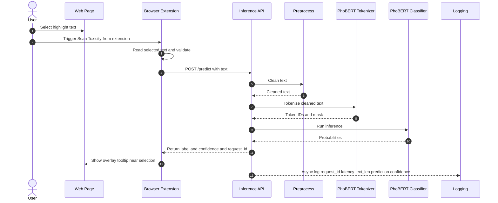

# vietnamese_toxic_comment_detection_using_PhoBERT

```mermaid
sequenceDiagram
  autonumber
  actor User
  participant Page as Web Page
  participant Ext as Browser Extension
  participant API as Inference API
  participant Pre as Preprocess
  participant Tok as PhoBERT Tokenizer
  participant Model as PhoBERT Classifier
  participant Log as Logging

  User->>Page: Select highlight text
  User->>Ext: Trigger Scan Toxicity from extension
  Ext->>Ext: Read selected text and validate
  Ext->>API: POST /predict with text
  API->>Pre: Clean text
  Pre-->>API: Cleaned text
  API->>Tok: Tokenize cleaned text
  Tok-->>API: Token IDs and mask
  API->>Model: Run inference
  Model-->>API: Probabilities
  API-->>Ext: Return label and confidence and request_id
  Ext->>Page: Show overlay tooltip near selection
  API-->>Log: Async log request_id latency text_len prediction confidence

```