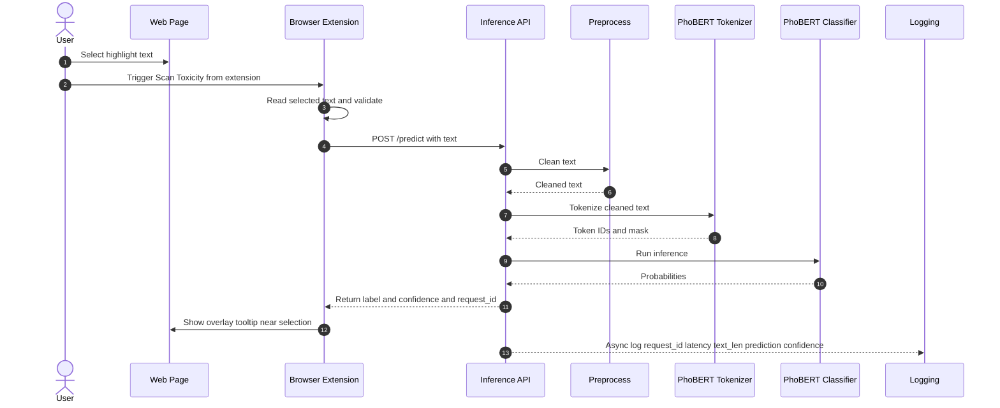

# vietnamese_toxic_comment_detection_using_PhoBERT


## Local UI + Backend (crawl + infer)

### 1) Python backend
```bash
python3 -m venv venv
source venv/bin/activate
pip install -r requirements.txt
```

Run API (from repo root):
```bash
uvicorn backend.app:app --reload --port 8000
```

### 2) Frontend UI (Vite)
```bash
cd comprehensive_ui
npm install
npm run dev
```

### 3) Sample request
```bash
curl -X POST http://localhost:8000/api/analyze \
  -H "Content-Type: application/json" \
  -d '{
    "urls": [
      "https://vnexpress.net/tranh-cai-ve-so-danh-hieu-cua-messi-4991489.html",
      "https://tuoitre.vn/cach-nao-de-cham-dut-viec-chui-boi-xuc-pham-tren-mang-20211027223924572.htm"
    ],
    "options": {
      "batch_size": 8,
      "max_length": 256,
      "page_threshold": 0.25,
      "seg_threshold": 0.4
    }
  }'
```

### Notes
- CORS: backend allows `http://localhost:5173` and `http://127.0.0.1:5173` by default.
- Default model path: `models_2/phobert/new` (override with `options.model_path` if needed).
