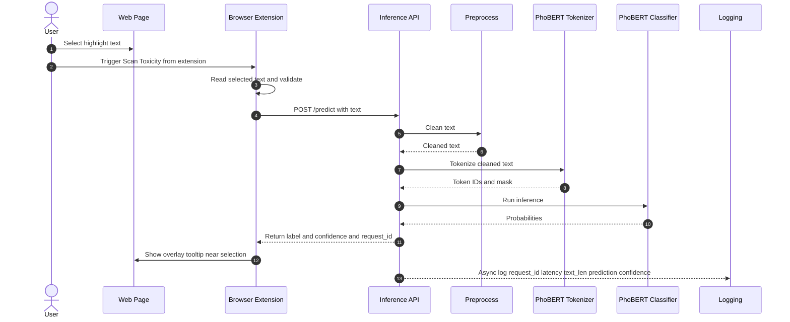

# vietnamese_toxic_comment_detection_using_PhoBERT


## Local UI + Backend (crawl + infer)

### 1) Python backend
```bash
python3 -m venv venv
source venv/bin/activate
pip install -r requirements.txt
```

Run API (from repo root):
```bash
uvicorn backend.app:app --reload --port 8000
```

### 2) Frontend UI (Vite)
```bash
cd comprehensive_ui
npm install
npm run dev
```

### 3) Sample request
```bash
curl -X POST http://localhost:8000/api/analyze \
  -H "Content-Type: application/json" \
  -d '{
    "urls": [
      "https://vnexpress.net/tranh-cai-ve-so-danh-hieu-cua-messi-4991489.html",
      "https://tuoitre.vn/cach-nao-de-cham-dut-viec-chui-boi-xuc-pham-tren-mang-20211027223924572.htm"
    ],
    "options": {
      "model_name": "phobert/v2",
      "batch_size": 8,
      "max_length": 256,
      "page_threshold": 0.25,
      "seg_threshold": 0.4
    }
  }'
```

### Notes
- CORS: backend currently allows all origins (`*`) for ease of local/ngrok testing.
- Model list endpoint: `GET /api/models`.
- Default model selection: ưu tiên `phobert/v2` nếu tồn tại trong `models/options/phobert/`, nếu không chọn model đầu tiên theo sort.
- Model id theo dạng `type/name` (vd: `phobert/v1`, `tfidf_lr/baseline`).
- Backward compatibility: vẫn có thể gửi `options.model_path` nếu muốn override trực tiếp.

### List available models
```bash
curl -X GET http://localhost:8000/api/models
```

## Expose Backend via ngrok

Public URL (reserved):
`https://living-rare-ram.ngrok-free.app`

### 1) Start server + ngrok
```bash
./scripts/run_server_ngrok.sh
```

The script:
- Activates `venv` or `.venv` if present.
- Starts `uvicorn` on `0.0.0.0:8000`.
- Starts ngrok with:
  `ngrok http 8000 --domain=living-rare-ram.ngrok-free.app`
- Warns if `~/.ngrok/ngrok.yml` or `NGROK_AUTHTOKEN` is missing.

### 2) Sample request (public)
```bash
curl -X POST https://living-rare-ram.ngrok-free.app/api/analyze \
  -H "Content-Type: application/json" \
  -d '{
    "urls": ["https://example.com"],
    "options": {
      "model_name": "phobert/v2",
      "batch_size": 8,
      "max_length": 256,
      "page_threshold": 0.25,
      "seg_threshold": 0.4
    }
  }'
```

### ngrok config (example only)
```yaml
version: "2"
authtoken: <NGROK_AUTHTOKEN>
tunnels:
  backend:
    addr: 8000
    proto: http
    domain: living-rare-ram.ngrok-free.app
```

Note: ngrok tunnel depends on the running process; keep the server + ngrok alive.

## Run with ngrok (Free tier, 2 tunnels)

This uses a single ngrok agent session with two tunnels: `api` (fixed domain) + `ui` (dynamic).

### 1) Run backend
```bash
./scripts/run_backend.sh
```

### 2) Run UI (Vite)
```bash
VITE_API_BASE_URL=https://living-rare-ram.ngrok-free.app ./scripts/run_ui.sh
```

### 3) Start ngrok tunnels
```bash
./scripts/run_ngrok_all.sh
```

### ngrok config (example only)
```yaml
version: "2"
authtoken: <NGROK_AUTHTOKEN>
tunnels:
  api:
    addr: 8000
    proto: http
    domain: living-rare-ram.ngrok-free.app
  ui:
    addr: 5173
    proto: http
```

### How it works
- API domain is fixed: `https://living-rare-ram.ngrok-free.app`
- UI domain is assigned by ngrok each time; use the URL printed by ngrok.
- UI reads API base from `VITE_API_BASE_URL` and calls `${API_BASE}/api/analyze`.

### End-to-end test
1) Open the public UI URL printed by ngrok (for the `ui` tunnel).
2) Submit a URL; UI will call the API via the fixed ngrok domain.

### Notes
- Restarting ngrok changes the UI URL, but API domain stays the same.
- Keep backend/UI/ngrok processes running for the tunnel to work.

## Quick Restart Guide (UI + Backend + ngrok)

Backend (8000)  <-- API  
UI (5173)       <-- Vite dev  
ngrok           <-- expose cả 2 (1 agent, 2 tunnels)

This setup requires **3 terminals**:
- Terminal 1: Backend
- Terminal 2: UI
- Terminal 3: ngrok

Run in this exact order:

```text
Terminal 1 — Backend API
./scripts/run_backend.sh

Terminal 2 — Frontend UI
VITE_API_BASE_URL=https://living-rare-ram.ngrok-free.app ./scripts/run_ui.sh

Terminal 3 — ngrok (2 tunnels, 1 agent)
./scripts/run_ngrok_all.sh
```

After everything is running:
- Open the **UI public URL** printed by ngrok (the `ui` tunnel). It will look like `https://<random>.ngrok-free.app`.
- The UI will call the API at `https://living-rare-ram.ngrok-free.app` automatically.

If you only see JSON like `{"status":"ok"...}`, you opened the API domain. Use the **UI** tunnel URL instead.

## Inference Sanity Check with Mock Data

We added a mock-data sanity check to verify that the inference script and domain-aware thresholding behave correctly.

- Mock inputs use toxic Vietnamese comment segments for both:
  - `news` URL: `https://vnexpress.net/gia-lap-bai-viet-test-domain-news-12345.html`
  - `social` URL: `https://facebook.com/mock-toxic-thread-99999`
- Run with forced probability (`--debug_force_prob`) to validate threshold logic deterministically.

Observed results:

- `mock_debug_060` (`debug_force_prob=0.60`)
  - `social` threshold `0.50` => toxic (`toxic_ratio=1.0`)
  - `news` threshold `0.72` => non-toxic (`toxic_ratio=0.0`)
- `mock_debug_099` (`debug_force_prob=0.99`)
  - both `social` and `news` => toxic (`toxic_ratio=1.0`)

Conclusion: inference flow and domain filter are working as expected in this mock test setup.
